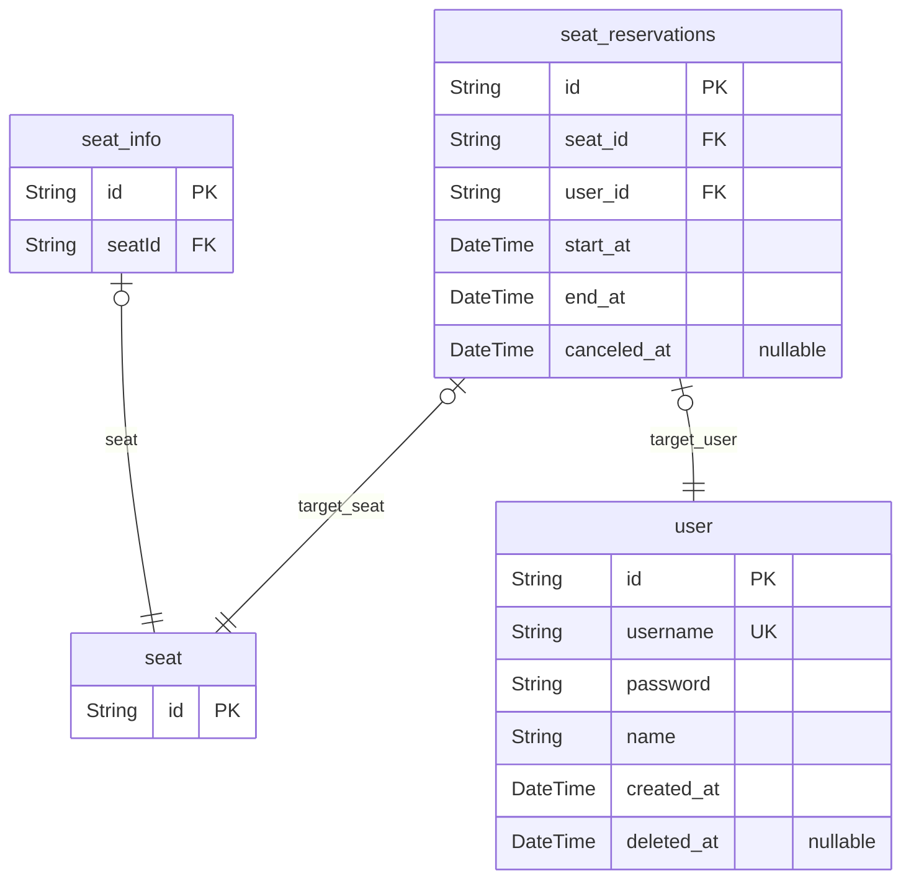

# PROJECT
> Generated by [`prisma-markdown`](https://github.com/samchon/prisma-markdown)

- [default](#default)

## default

### `user`

**Properties**
  - `id`: 
  - `username`: 
  - `password`: 
  - `name`: 
  - `created_at`: 
  - `deleted_at`: 

### `seat`

**Properties**
  - `id`: 

### `seat_info`

**Properties**
  - `id`: 
  - `seatId`: 

### `seat_reservations`

**Properties**
  - `id`: 
  - `seat_id`: 
  - `user_id`: 
  - `start_at`: 
  - `end_at`: 
  - `canceled_at`: 